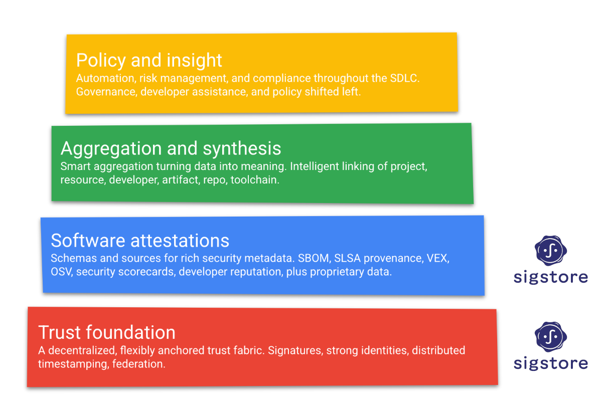

# Objective of this Document

This document provides a shared, public view of the community roadmap for [Sigstore](https://sigstore.dev) projects and services from September 2023 through 2024 (and beyond). It aims to have greater accuracy and specificity in shorter time horizons, while providing perspective on our longer term aspirations.

# Background
## Problem Statement

Digital signatures play a critical role in the software supply chain, by providing verifiable attributes of authentication, integrity, and non-repudiation of artifacts as they are distributed between consumers and producers. Adoption of digital signatures within open source software ecosystems has been impeded by significant complexity, poor user experience, and scalability challenges in binding key material to digital identities.

Given the dramatic rise in attacks on both open and closed source software supply chains, the industry is racing to generate new metadata (aka attestations) that provide greater visibility to the provenance of artifacts and their inherent properties. Without a strong binding between the identity of authors of attestations and an assurance to their integrity as they flow between actors in the supply chain, this additional metadata will at best be untrusted noise and at worst a new vector for malicious attackers to exploit.

## Previous Attempts

Digital signature schemes are based on asymmetric cryptography; this requires signers to manage both the distribution of public key material to verifiers and protection of private key material to avoid compromise. In addition, it is desirable to have a system that publishes the binding of the digital identity of signers to their public key material. This enables verifiers to make more intuitive trust decisions (e.g., “who do I trust” vs “which key(s) do I trust”) through centralized or decentralized networks of trust.

The most notable attempt at enabling pervasive digital signatures throughout the software supply chain is PGP, which is ratified as an IETF standard and has numerous implementations to create and verify digital signatures while also enabling a decentralized web of trust. While PGP did achieve some adoption, it is ultimately viewed by the wider OSS community as [no longer viable](https://latacora.micro.blog/2019/07/16/the-pgp-problem.html) due to [poor user experience and challenges with key management](https://blog.yossarian.net/2023/05/21/PGP-signatures-on-PyPI-worse-than-useless).

## Brief Overview of Sigstore

[Sigstore](https://sigstore.dev) was founded in June of 2020 to address the fundamental challenges preventing wide scale usage of digital signatures within the software supply chain. Sigstore is a set of open source projects and services that dramatically simplify the creation and verification of digital signatures. It achieves this through a modular architecture that integrates proven technology solutions from adjacent domains (including Certificate Transparency, OpenID Connect, and Workload Identity among others) while reusing industry standard cryptographic algorithms and best practices. 

Sigstore is inherently flexible and can natively support a variety of:

* deployment scenarios (e.g. public-facing VS private enterprise deployments), 
* key management approaches (e.g. hardware-backed keys stored in HSMs or Yubikeys or ephemeral scenarios where a private key can be deleted immediately after use),
* operating environments (public or private clouds, on-premises),
* identities provided by OpenID Connect tokens, including developer and workload identities
* programming languages

Since its founding, Sigstore has grown into one of the top 25 largest and fastest growing open source communities under the Linux Foundation. The community includes over 1,400 unique contributors composed of both unaffiliated individuals and 91 unique organizations. Sigstore projects and services are sponsored by the Open Source Security Foundation (OpenSSF) which provides neutral governance and oversight to the project. 

Sigstore is best thought of as an “umbrella brand”, encompassing [several open source projects](https://github.com/sigstore) and public-good services which are provided to everyone at no cost. These instances aim to adhere to a 99.5% SLO and are supported by a multi-vendor on-call rotation to ensure neutrality and a tight feedback loop between project maintainers and service operators.

## Current Status (as of July 2024)

At the time of writing, the public Rekor signature transparency log contains over 101 million entries representing signatures from more than 33,000 unique open source projects including Kubernetes, CPython, Istio, urllib3, and Tekton (more [adopters](https://github.com/sigstore/friends) can be seen at the Sigstore [project landscape](https://landscape.openssf.org/sigstore)). Sigstore’s certificate authority has issued more than 21 million short-lived code signing certificates based on the OpenID Connect identity binding approach.  

Sigstore announced the [general availability](https://openssf.org/press-release/2022/10/25/sigstore-announces-general-availability-at-sigstorecon/) of its public-good services in October of 2022 which built upon the v1.0 releases of Cosign, Fulcio, and Rekor. The public services have consistently met their 99.5% availability SLO since that milestone.

Sigstore has several implementations of its core signing and verification workflows for popular programming languages, including:

| Programming Language | Repository               |       Status      |
|:--------------------:|--------------------------|:-----------------:|
|        Go            | [sigstore/cosign](https://github.com/sigstore/cosign)          |         GA        |
|        Python        | [sigstore/sigstore-python](https://github.com/sigstore/sigstore-python) |         GA        |
|      Javascript      | [sigstore/sigstore-js](https://github.com/sigstore/sigstore-js)     |         GA        |
|         Java         | [sigstore/sigstore-java](https://github.com/sigstore/sigstore-java)   |        Beta       |
|         Rust         | [sigstore/sigstore-rs](https://github.com/sigstore/sigstore-rs)     |        Beta       |
|        Go            | [sigstore/sigstore-go](https://github.com/sigstore/sigstore-go)     | Beta |
|         Ruby         | [sigstore/sigstore-ruby](https://github.com/sigstore/sigstore-ruby)   |     pre-Alpha     |

## Adoption Patterns for Sigstore

One of the key tenets of the Sigstore community’s strategy has been to focus on open source package managers as our primary stakeholders. OSS package managers serve as a critical link in the overall software supply chain, both in the distribution of artifacts & metadata but also often as an implicitly trusted actor that is expected to curate content based on static and transient information. Package managers also typically create command line tools used to download, install and manage packages on systems in a variety of environments.

A package manager looking to adopt Sigstore as part of its artifact signing and verification workflows will generally follow these steps, adjusted appropriately to the nuances of the specific programming language and/or ecosystem:

1. Develop language-specific implementation of Sigstore’s signing and verification workflows (if one does not already exist)
2. Integrate language-specific Sigstore signing and verification functionality into package management tooling
3. Add support for storing Sigstore signatures & attestations in the package registry for consumers to access
4. Publish community RFC proposal describing end-to-end workflows, ecosystem-specific threat model, and roadmap for adoption
5. Once RFC proposal is approved per community norms, drive implementation plan
6. Work to drive initial package adoption strategy; this often involves highly visible or valuable packages that can serve as references for other package maintainers within the ecosystem
7. Work with popular build & packaging extensions (e.g. GoReleaser, JReleaser) and builder templates (Jenkins plugins, GitHub Actions, GitLab CI, etc)
8. Release all code & service extensions required for Sigstore support in a fully-supported mode
9. Presuming success to this point, set date for mandating Sigstore signing and verification for all packages in ecosystem 

## Current Ecosystem Adoption Status

The npm registry, the world's largest open source package manager for the JavaScript ecosystem, [recently announced built-in support for Sigstore-signed SLSA build provenance](https://github.blog/2023-04-19-introducing-npm-package-provenance/) to users. This allows consumers of packages from npm to independently verify the link between a package fetched from the npm registry to the source code from which it was built. The build provenance attestation is cryptographically signed using Sigstore. Other package managers may find the [documentation of npm's Sigstore adoption and resulting design decisions](https://repos.openssf.org/build-provenance-for-all-package-registries) useful.

Homebrew, the predominant package manager for MacOS, recently announced [built-in support build provenance and code signing based on Sigstore](https://blog.sigstore.dev/homebrew-build-provenance/). This means that each bottle (binary package) built by Homebrew will include a cryptographically verifiable statement that binds the bottle's content to the specific workflow and build-time metadata that produced it. Sigstore makes the signing and verification of Homebrew's ~7000 bottles (representing hundreds of millions of downloads per year) boring and easy.  

The Python ecosystem (and its official third party package repository PyPI) are also [working on integrating Sigstore](https://yossarian.net/res/pub/pycon-2023.pdf) into their package publishing and verification workflow via PEPs 458, 480, 691 & 694 based on the recent sigstore-python GA release. 

The Java ecosystem is also working to integrate Sigstore, through a Java-native SDK and integrations with [Maven Central](https://blog.sonatype.com/maven-central-and-sigstore). The Sigstore community is also working closely with the Eclipse Foundation who is exploring adding support for signing and verification of artifacts within Eclipse projects.

The table below summarizes the state of Sigstore adoption across various ecosystems:

| Ecosystem            | State                                     |       Status         |
|:--------------------:|:-----------------------------------------:|:--------------------:|
|        npm           | signing + provenance (SLSA)               |         GA           |
|        Maven         | signing only                              |  In Progress         |
|      PyPI            | attestation storage & client verification |  In Progress         |
|         RubyGems     | signing & verfication                     |  In Progress         |
|  Spring + Gradle     | signing + provenance (SLSA)               |   Early WIP          |
|        Homebrew      | signing + provenance (SLSA)               |   Beta               |
|   GitHub Actions     | signing + provenance (SLSA)               |         GA           |

Last but certainly not least, Sigstore has publicly hosted [documentation](https://docs.sigstore.dev) that includes an architectural overview and a community-authored [threat model](https://docs.sigstore.dev/threat-model/) and [claimant models](https://github.com/sigstore/community/tree/main/docs/claimantmodel) for the transparency logs it operates. There are also more detailed [architecture documents](https://docs.google.com/document/d/1-OccxmZwkZZItrfOnO3RP8gku6nRbtJpth1mSW3U1Cc/edit#heading=h.ksk0rwk2ti2e) being created to describe the principles behind our signature transparency log, certificate authority, and public-good instances.

# Mission (aka our purpose)

> Ensure that all artifacts and metadata that are used within any software supply chain have verifiable, transparent integrity and provenance so that consumers can make explicit trust decisions

# Vision (aka our desired future state)
Inclusive of the projects, public-good services, and standardized interfaces, Sigstore is both a de facto & de jure standard for both the signing and verification of software artifacts and metadata. Through an open source execution model and with support of the OpenSSF, Sigstore will be:

## Pervasive
* Vast majority of OSS ecosystems and package managers natively use Sigstore to sign software artifacts & metadata (e.g. binaries, attestations, etc) and verify on installation, using the public good infrastructure as a ledger-of-record for OSS artifacts.
* Specific OSS ecosystems or companies may operate their own instances of Sigstore services (either a subset or entire copy) in an effort to provide additional assurances/claims (e.g. binary transparency), assert trust domains, enforce an admission control policy, or address scalability challenges. These instances should be compatible with and verifiable by existing Sigstore tooling
* Sigstore can be used in private ecosystems (e.g. Apple App Store, Google Play Store, Microsoft Windows applications)

## Standardized
* Signature attestation expressed in a consistent schema (i.e. “Sigstore bundle”) that is an open standard (e.g. IETF RFC)
* API surface for transparency logs and certificate issuance is well documented and accepted as an open standard (e.g. IETF RFC, ACME)
* Public instances of Fulcio provide consistent requirements for supported identity providers & certificate extensions similar to how CA/B Forum requirements are enforced for web PKI certificate authorities

## Seamless
* Verification is built into all major package manager client tools by default - there is no consumer responsibility to change behavior but users get improved safety for free (i.e. secure by default)
* Signature generation requires very minimal configuration for artifacts generated by CI/CD platforms like GitHub Actions or GitLab

## Robust
* Sigstore projects and services are highly regarded for their reliability, high quality, and excellent documentation
* Sigstore projects and services utilize secure development and deployment practices, including dependency and vulnerability management, regular audits of code & deployment environments, and vulnerability disclosure processes
* Even as Sigstore naturally spans different implementation scenarios, programming languages, and use cases - the experience is refreshingly consistent

## Neutral
* While under operation by the Sigstore community, no one organization or individual can unilaterally control Sigstore’s trust root or public infrastructure services
* Sigstore’s public good infrastructure services shift to being operated by a neutral, non-profit organization
* Sigstore’s federated identity provider adheres to a published policy for the requirements of all integrated OpenID Connect providers (similar to the CA/B forum)

## Transparent
* Multiple “monitors” observe state of Sigstore-based transparency logs, attesting to append-only property
* Sufficient “witness” model to share views of transparency logs, allowing clients to mitigate risks of split view attacks
* Developer-managed "verifiers" and verifiable search to enable CUJs around key compromise detection, code signing certificate mis-issuance 

## Verifiable
* All verification operations done by the infrastructure should be independently verifiable
* Implement [cryptographically verifiable proof](https://security.googleblog.com/2023/06/bringing-transparency-to-confidential.html) of the certificate authority and transparency log services using remote attestations and build provenance

## Privacy-conscious
* Strong bias towards use of workload-identity instead of human identity
* Use emerging techniques (verifiable random functions, zero-knowledge proofs) to remove PII from log entries wherever possible
* Support offline verification as default and ensure log monitors & witness have sufficient anonymity
* Support redaction of entries to transparently remove sensitive data when necessary

## Flexible
* Continued first-class support for both public vs private deployments
* Continued interoperability with variety of key material / services (Yubikey, KMS, “keyless”)
* Identity associated with developers or workloads
* Enable pluggable trust roots and/or delegated roots

## Reliable
* Continued maintenance of the public good infrastructure with the goal of 99.5% uptime

# Strategy (broad efforts describing how the community will realize its vision)

### **Focus on OSS package managers as the primary path for Sigstore adoption in the OSS ecosystems**

* Use “rolling thunder” approach, capitalizing on learnings from one package manager to accelerate adoption by subsequent ones
* Focus on success of npm, PyPI, and Java ecosystems in 2023, with others soon to follow

### **Leverage a single signing and verification implementation that is scalable, memory safe and appropriately cryptographically agile - and aggressively reuse it wherever possible**

* Default to client design where we have a single implementation of core verification logic, and use foreign function interface to bridge into language-specific ecosystems
* Use conformance testing across all implementations to ensure consistency of behavior

### **Prioritize transition of public log & certificate authority operations to neutral entity with committed funding model**

* Ensure long-term viability of public-good services to continue zero-friction, zero-cost adoption
* Kick off fundraising campaign to provide multi-year funding for ongoing operations, SRE, infrastructure costs
* Frees up community resources to focus on development & standardization

### **Pursue open standards-track ratification of APIs, signature attestation formats via IETF**

* Leverage documents written for ISRG as baseline RFC proposals

### **Ensure Rekor and Fulcio are sufficiently robust & scalable for anticipated growth**

* Complete performance analysis to ensure appropriate rate limits and incremental cost vectors are known
* Perform regular sharding and key rotation actions to ensure freshness and accuracy of playbooks

### **Make Sigstore infrastructure services simpler to operate for both public and private operators**

* Continue to invest in infrastructure tooling (e.g. Helm charts, Terraform modules) that simplify deployment and management of Sigstore services
* Continue to collaborate with TUF ecosystem to make parallel and delegated roots of trust fully supported

### **Create SIGs within Sigstore community to drive focused discussion & execution around critical topics**

* SIG-clients to foster collaboration and standardization between Sigstore clients
* SIG-ops to focus on the operation of the public-good infrastructure and handoff to a neutral entity

### **Create excellent onboarding path for users and log operators across both technical and non-technical dimensions**

* Explain what a log does (and does not) provide

### **Work with the transparency, academic, and package repositories communities to monitor log consistency**

* Deploy log witnesses across different trust boundaries
* Encourage community members to operate log witnesses
* Develop a witness network with a tiered approach to log witnesses and distributors
* Provide tooling for individuals to monitor logs for their signing identities

### **Collaborate with academic community to provide stronger trust assurances and privacy guarantees**

* Provide attestations of trusted actions, such as verifying identity tokens, to minimize needed trust in service operators
* Use modern cryptography (zero-knowledge proofs, verifiable random functions) to remove PII where possible

### **Ensure that verification is as seamless as signing**

* Integrate with existing verification policy languages (e.g. Rego, CUE)
* Provide a reference implementation for how to verify signatures across various points in the software development lifecycle

### **Offer intuitive and ergonomic tooling for engineers and cloud operations**

* [Cosign CLI](https://github.com/sigstore/cosign) is the official Sigstore CLI multi-tool for signing and verification in a variety of environments and use cases.
* [sigstore-policy-controller](https://github.com/sigstore/policy-controller) is the center of Sigstore-oriented verification flows in Kubernetes environments.

# Roadmap

## Client SDKs

### Short Term (< 6 mo)

* Releases:
    * sigstore-java v1 release
    * sigstore-go beta release
    * sigstore-rust v1 release
    * sigstore-python v2 release
* FFI Design
* Support for bundle format across all Sigstore clients
* Simplifying verification policy
    * Improve Cosign UX for specifying OIDC identities
    * Supporting CI claims
* Complete architecture documentation for clients
* Client maturity criteria
* All clients are integrated with the conformance test suite. All tests may not succeed, but tests are run periodically

### Medium Term (6-12 mo)

* FFI Implementation
* Port at least one language to make use of FFI implementation
* Releases:
    * sigstore-go v1 release
    * Gitsign v1 release
    * policy-controller v1 release
* Supporting BYO PKI and private deployments in Sigstore clients
* Improved testing
    * End-to-end testing
    * Conformance tests are passing for all clients
    * Fuzz tests
* Improving verification policies
    * Rego/CUE integration
    * [Hammurabi from web PKI](https://www.andrew.cmu.edu/user/bparno/papers/hammurabi.pdf)
* Reduce size of Cosign binary, fewer dependencies
* Privacy-preserving telemetry (https://divviup.org/)

### Long Term (12+ mo)

* Plumbing and porcelain model for Cosign, to improve Cosign's user experience
* Policy: sophisticated verification policies, or deeper integration with a policy evaluation service
* Further integration with TUF through delegations or trusted verification material distribution, and in-toto for signed provenance
* Adding additional conformance tests to verify consistent behavior across clients, including negative tests
* Bundle format includes attestation support that interops with SLSA
* Reference implementation of how to use signature verification across various points in the software development lifecycle, leveraging policy-controller as one example
* Tooling to support client revocation policies

## Signature Transparency Log (Rekor)

### Short Term (< 6 mo)

* Add 2 independent log monitors
    * Monitors will only verify log consistency
* Witnessing
    * Monitors should transition into fully fledged witnesses
    * Witnesses should publish signed checkpoints to distributor
* V1 for GitHub Actions-based identity monitor
* Timestamp at Entry Upload
    * Timestamp should be provided by TSA
    * Timestamp becomes immutable and verifiable
* Complete architecture document
* Publish inclusion events to pub/sub queue

### Medium Term (6-12 mo)

* API v2 Design & Implementation
    * Reduce API surface to be structured around key types, push parsing logic to clients
    * Must support witnessing without compromises
* MVP split-view attack mitigation
    * Client requests witnessed checkpoints from a set of witnesses or distributors
    * Client verifies inclusion proof from log using checkpoint size
    * Offline verifiable proofs include witnessed checkpoints in Bundle
* Verifiable Search Design
    * Detecting credential compromise without requiring constant log scraping
* Design transparent redaction mechanism
* Reviewing sharding strategy to better align with Certificate Transparency's sharding
* Experiment with serverless/log tile format for caching and scalability
* Design log replication mechanism for scaling instances (possibly can use serverless)

### Long Term (12+ mo)

* Verifiable Search Implementation
* Package repositories participate in mitigating split-views
    * Witnessed checkpoints attached to artifact signature metadata
    * Repositories verify log consistency
* Implementation for log replication
* Transparent redaction implementation
* Privacy-preserving log queries, where the log is not aware of client's artifact of interest
* Roughtime for distributed trusted timestamps
* Continued fuzzing of large API surface

## Transparency Log Monitor

### Short Term (< 6 mo)

* Initial launch of Sigstore's [log monitor on GitHub Actions](https://github.com/sigstore/rekor-monitor)
   * Monitor acts as both a witness (co-signing checkpoints) and Verifier (monitoring given identities)
   * Co-signed checkpoints are published to GitHub
   * Verifier monitors for OIDC identities and key fingerprints
   * Alerts are filed as GitHub issues
   * Supports sharded log
* At least 2 independent instances of GitHub Actions-based log monitor running and publicly documented
* Publish blog posts on monitoring requirements as an artifact producer
* Create log cloning tool to support offline log monitoring and analysis
   * Can also be used to transform an existing log into a serverless layout

### Medium Term (6-12 mo)

* V1 launch of Sigstore's [log monitor on GitHub Actions](https://github.com/sigstore/rekor-monitor)
   * Witnessed checkpoints are published to distributors, operated by Sigstore and/or community members. Distributor may be GitHub Actions-based
   * Support monitoring Fulcio's certificate transparency log
   * Alerts are sent in a variety of ways (e.g. email, page)
   * Productionized and resilient against intermittent failures
* Publish select monitors to status.sigstore.dev

### Long Term (12+ mo)

* Optionality around running witnesses in different environments, e.g. hardware or cloud
* Integration with other efforts in transparency ecosystems
   * Publishing checkpoints to external community-operated distributors
* Collaborate with CT log monitors (e.g. [sslmate](https://sslmate.com/certspotter/)) to improve identity monitoring

## Certificate Authority (Fulcio)

### Short Term (< 6 mo)

* Hashed email addresses/PII
    * Still supports monitoring identities
* Complete architecture document
* Fulcio CI identity provider onboarding automation
* Standardize OIDC identity provider requirements for inclusion in public instance

### Medium Term (6-12 mo)

* Privacy-preserving identities
    * VRFs or ZKP to prevent attacker from learning when a signing event occurred for a given identity
    * Must still support identity monitoring
* Zero-knowledge proofs that prove a CA verified an identity token

### Long Term (12+ mo)

* ACME for code-signing certificates (ongoing RFC)
* Native SPIFFE support with X509-SVIDs as authenticators, rather than supporting only OIDC
* Support revocation for private deployments

## Deployment Infrastructure / Configuration

### Short Term (< 6 mo)

* Move builds off GCB onto GHA
* Adopt SLSA L3 builders and publish provenance

### Medium Term (6-12 mo)

* Refactoring helm-charts based on new common chart format
* Work with the community to support private deployments

### Long Term (12+ mo)

* Terraform for non-GCP architecture

## Documentation

### Short Term (< 6 mo)

* Documentation restructured around user journeys
* Document workload identity/automated signing in addition to developer-driven signing
* Terminology page

### Medium Term (6-12 mo)

* Developer documentation
* Architecture documents published

### Long Term (12+ mo)

* Documentation versioned for tooling releases
* Improvements to branding website

## Public-Good Instances

### Short Term (< 6 mo)

* Publish document on public vs private deployments
* Maintain operational excellence:
    * 99.5% SLO
    * Multi-vendor on call rotation
    * Continued burn down of open tickets
    * Periodic DiRT testing
* Perform 1 log sharding and log key rotation
* Complete architecture document, get commitment on operational transfer
* Migrate TUF root repository over to TUF-on-CI

### Medium Term (6-12 mo)

* Begin transition of public instance to neutral third party
* Release automation
    * New releases should go to staging automatically
    * Releases should seamlessly move from staging to production with automated testing
* New bleeding-edge environment
    * Hourly/nightly releases should automatically deploy to this env
* Availability improvements
    * Regionalization of components
    * Read replicas of log
* Improve automated issue filing for alerts

### Long Term (12+ mo)

* Public root of trust trusted by private ecosystems (Apple App Store, Google Play Store, Windows)
* Public instance has been fully transitioned to neutral third party

## Community

### Short Term (< 6 mo)

* Add more community-operated timestamp authorities
* TUF root supports additional delegations

### Medium Term (6-12 mo)

* BigQuery dataset for researchers
* Alignment within OpenSSF (SCI WG, Security Toolbelt)

### Long Term (12+ mo)

* Sigstore API specified in IETF RFC

## Timestamp Authority

Feature complete. Future improvements include integrating timestamps into Rekor entries and exploring Roughtime as an alternative for distributed trusted timestamping.
