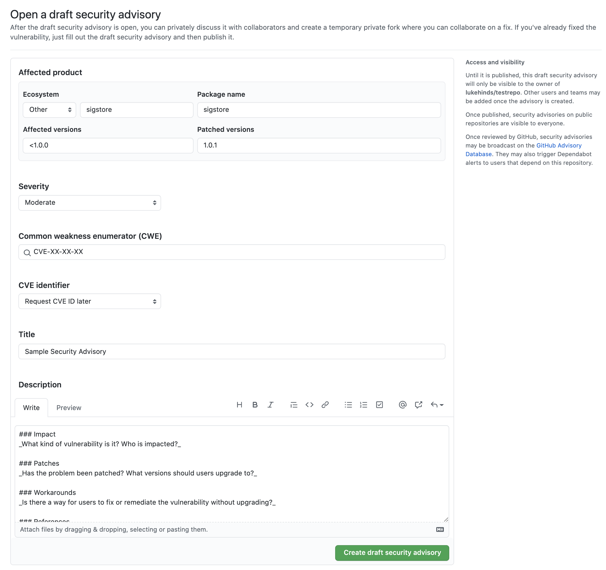
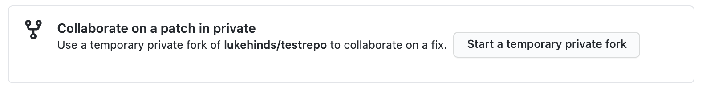
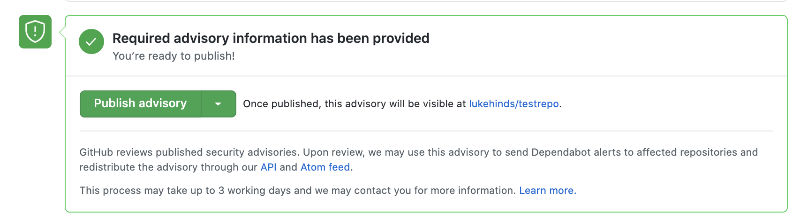

# Sigstore Security Vulnerability Process

sigstore is a growing community of volunteers, users, and vendors. The sigstore community has adopted this security disclosures and response policy to ensure we responsibly handle critical issues.

## Security Response Committee (SRC)

Security vulnerabilities should be handled quickly and sometimes privately. The primary goal of this process is to reduce the total time users are vulnerable to publicly and privately known exploits.

The SRC are responsible for organizing the entire response including internal communication and external disclosure, but will need help from relevant maintainers to successfully run this process.

### SRC Members

The initial SRC is bootstrapped from the sigstore TSC members:

* Luke Hinds (lhinds@protonmail.com) [GPG Key](https://api.protonmail.ch/pks/lookup?op=get&search=lhinds@protonmail.com)
* Bob Callaway (bob.callaway@gmail.com) [GPG Key](https://api.github.com/users/bobcallaway/gpg_keys)
* Dan Lorenc (dlorenc@protonmail.com) [GPG Key](https://api.protonmail.ch/pks/lookup?op=get&search=dlorenc@protonmail.com)

The  members will share various tasks as listed below:

- Triage: Assess the impact of the vulnerability (can it be replicated, is the code in sigstore or upstream?)
- Infra: Create a security advisory and temporary fork for the fix team to work on the issue
- Disclosure: Handle public messaging around the vulnerability, by documenting the issue (how to upgrade, list affected versions, draft an advisory notice)
- Release: Create new release addressing a security fix and notify the public

### Contacting the Security Response Committee

Contact the team by sending email to the [SRC Members](#SRC-Members)

### Security Response Committee Membership

#### Joining

The SRC should ideally consist of 2-4 members. New potential members to the SRC can express their interest to the SRC members. These individuals can be nominated by SRC members or sigstore maintainers to the current SRC members. Membership if possible should be vendor diverse (no more than 2:1 ratio of representation from any single vendor)

If representation changes due to job shifts then SRC members are encouraged to grow the team or replace themselves through mentoring new members.

##### Security Response Committee Lazy Consensus Selection

Selection of new members will be done by lazy consensus amongst members for adding new people with fallback on majority vote.

#### Stepping Down

Members may step down at any time and propose a replacement from existing active contributors of sigstore.

#### Responsibilities

- Members must remain active and responsive.
- Members taking an extended leave of two weeks or more should coordinate with other members to ensure the role is adequately staffed during the leave.
- Members going on leave for 1-3 months may identify a temporary replacement.
- Members of a role should remove any other members that have not communicated a leave of absence and either cannot be reached for more than 1 month or are not fulfilling their documented responsibilities for more than 1 month. This may be done through a super-majority vote of members.

## Disclosures

### Private Disclosure Processes

The sigstore Community asks that all suspected vulnerabilities be handled in accordance with [Responsible Disclosure model](https://en.wikipedia.org/wiki/Responsible_disclosure).

### Public Disclosure Processes

If anyone knows of a publicly disclosed security vulnerability please IMMEDIATELY email the [SRC Members](#SRC-Members) to inform the SRC about the vulnerability so they may start the patch, release, and communication process.

If a reporter contacts the SRC to express intent to make an issue public before a fix is available, the SRC will request if the issue can be handled via a private disclosure process. If the reporter denies the request, the SRC will move swiftly with the fix and release process.

## Patch, Release, and Public Communication

For each vulnerability, the SRC members will coordinate to create the fix and release, and notify the rest of the community.

All of the timelines below are suggestions and assume a Private Disclosure.

- The SRC drives the schedule using their best judgment based on severity, development time, and release work.
- If the SRC is dealing with a Public Disclosure all timelines become ASAP.
- If the fix relies on another upstream project's disclosure timeline, that will adjust the process as well.
- We will work with the upstream project to fit their timeline and best protect sigstore users.

### Fix Team Organization

These steps should be completed within the first 24 hours of Disclosure.

- The SRC will work quickly to identify relevant engineers from the affected projects and packages and being those engineers into the [security advisory](https://docs.github.com/en/code-security/security-advisories/) thread.
- These selected developers become the "Fix Team" (the fix team is often drawn from the projects MAINTAINERS)

### Fix Development Process

These steps should be completed within the 1-7 days of Disclosure.

- The SRC and the Fix Team will create a [CVSS](https://www.first.org/cvss/specification-document) using the [CVSS Calculator](https://www.first.org/cvss/calculator/3.0) to determine the effect and severity of the bug. The SRC makes the final call on the calculated risk; it is better to move quickly than make the perfect assessment.
- The SRC will request a [CVE](https://cveform.mitre.org/).
- The SRC will create a new [security advisory](https://docs.github.com/en/code-security/security-advisories/) in affected repository by visiting `https://github.com/sigstore/<project>/security/advisories/new`
- As many details as possible should be entered such as versions affected, CVE (if available yet). As more information is discovered, edit and update the advisory accordingly.

- The Fix team is added to the security advisory as collaborators
- The SRC / Fix Team create a private temporary fork

- The Fix team performs all work in a 'security advisory' and its temporary fork
- All communication happens within the security advisory, it is *not* discussed in slack channels or non private issues.
- The Fix Team will notify the SRC that work on the fix branch is completed, this can be done by tagging names in the advisory
- The Fix team and the SRC will agree on fix release day
-  The recommended release time is 4pm UTC on a non-Friday weekday. This means the announcement will be seen morning Pacific, early evening Europe, and late evening Asia.

If the CVSS score is under ~4.0
([a low severity score](https://www.first.org/cvss/specification-document#i5)) or the assessed risk is low the Fix Team can decide to slow the release process down in the face of holidays, developer bandwidth, etc.

Note: CVSS is convenient but imperfect. Ultimately, the SRC has discretion on classifying the severity of a vulnerability.

The severity of the bug and related handling decisions must be discussed on in the security advisory, never in public repos.

### Fix Disclosure Process

With the Fix Development underway, the SRC needs to come up with an overall communication plan for the wider community. This Disclosure process should begin after the Fix Team has developed a Fix or mitigation so that a realistic timeline can be communicated to users.

**Fix Release Day** (Completed within 1-21 days of Disclosure)

- The Fix Team will approve the related pull requests in the private temporary branch of the security advisory
- The SRC will merge the security advisory / temporary fork and its commits into the main branch of the affected repository

- The SRC will ensure all the binaries are built, signed, publicly available, and functional.
- The SRC will announce the new releases, the CVE number, severity, and impact, and the location of the binaries to get wide distribution and user action. As much as possible this announcement should be actionable, and include any mitigating steps users can take prior to upgrading to a fixed version. An announcement template is available below. The announcement will be sent to the the following channels:
  - sigstore-dev@googlegroups.com
- A link to the google groups email will be posted to the [sigstore slack workplace](https://sigstore.slack.com) in the general and development channels

### Security Fix Announcement Template

```
Subject: Security release of sigstore/<project/ $VERSION is now available
To: sigstore-dev@googlegroups.com

Hello sigstore Community,

The Security Response Committee and maintainers of sigstore/$PROJECT would like
to announce the availability of sigstore/$PROJECT $VERSION.

This addresses the following CVE(s):

* CVE-YEAR-ABCDEF (CVSS score $CVSS): $CVESUMMARY
...

Upgrading to $VERSION is encouraged to fix these issues.

**Am I vulnerable?**

Run `$PROJECT --version` and if it indicates a base version of $OLDVERSION or
older that means it is a vulnerable version.

<!-- Provide details on features, extensions, configuration that make it likely that a system is
vulnerable in practice. -->

**How do I mitigate the vulnerability?**

<!--
[This is an optional section. Remove if there are no mitigations.]
-->

**How do I upgrade?**

<!--
[Outline upgrade steps]
-->

**Vulnerability Details**

<!--
[For each CVE]
-->
  ```

## Retrospective

These steps should be completed 1-3 days after the Release Date. The retrospective process [should be blameless](https://landing.google.com/sre/book/chapters/postmortem-culture.html).

- The SRC will send a retrospective of the process to sigstore-dev@googlegroups.com including details on everyone involved, the timeline of the process, links to relevant PRs that introduced the issue, if relevant, and any critiques of the response and release process.
- The SRC and Fix Team are also encouraged to send their own feedback on the process to sigstore-dev@googlegroups.com. Honest critique is the only way we are going to get good at this as a community.

## Credit

Part of this process were inspired by the etc-d's security handling process.
