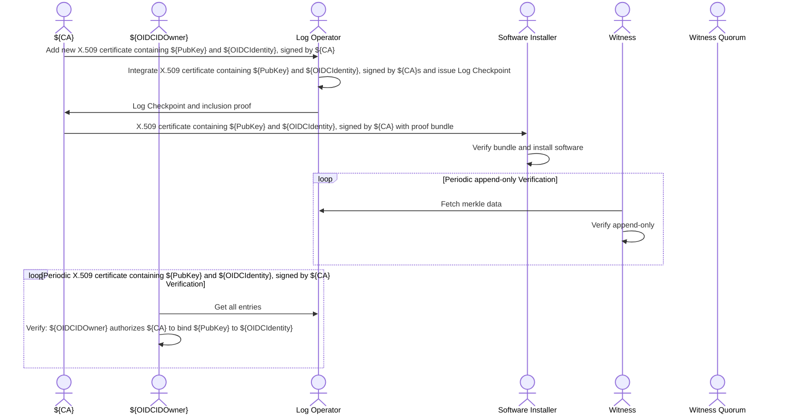

```mermaid
sequenceDiagram
    actor ${CA}
    actor ${OIDCIDOwner}
    actor Log Operator
    actor Software Installer
    actor Witness
    actor Witness Quorum
    ${CA}->>Log Operator: Add new X.509 certificate containing ${PubKey} and ${OIDCIdentity}, signed by ${CA}
    Log Operator->>Log Operator: Integrate X.509 certificate containing ${PubKey} and ${OIDCIdentity}, signed by ${CA}s and issue Log Checkpoint
    Log Operator->>${CA}: Log Checkpoint and inclusion proof
    ${CA}->>Software Installer: X.509 certificate containing ${PubKey} and ${OIDCIdentity}, signed by ${CA} with proof bundle
    Software Installer->>Software Installer: Verify bundle and install software
    loop Periodic append-only Verification
        Witness->>Log Operator: Fetch merkle data
        Witness->>Witness: Verify append-only
    end
    loop Periodic X.509 certificate containing ${PubKey} and ${OIDCIdentity}, signed by ${CA} Verification
        ${OIDCIDOwner}->>Log Operator: Get all entries
        ${OIDCIDOwner}->>${OIDCIDOwner}: Verify: ${OIDCIDOwner} authorizes ${CA} to bind ${PubKey} to ${OIDCIdentity}
    end
```