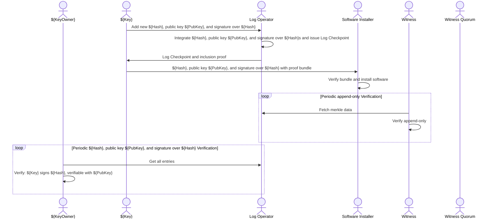

```mermaid
sequenceDiagram
    actor ${KeyOwner}
    actor ${Key}
    actor Log Operator
    actor Software Installer
    actor Witness
    actor Witness Quorum
    ${Key}->>Log Operator: Add new ${Hash}, public key ${PubKey}, and signature over ${Hash}
    Log Operator->>Log Operator: Integrate ${Hash}, public key ${PubKey}, and signature over ${Hash}s and issue Log Checkpoint
    Log Operator->>${Key}: Log Checkpoint and inclusion proof
    ${Key}->>Software Installer: ${Hash}, public key ${PubKey}, and signature over ${Hash} with proof bundle
    Software Installer->>Software Installer: Verify bundle and install software
    loop Periodic append-only Verification
        Witness->>Log Operator: Fetch merkle data
        Witness->>Witness: Verify append-only
    end
    loop Periodic ${Hash}, public key ${PubKey}, and signature over ${Hash} Verification
        ${KeyOwner}->>Log Operator: Get all entries
        ${KeyOwner}->>${KeyOwner}: Verify: ${Key} signs ${Hash}, verifiable with ${PubKey}
    end
```