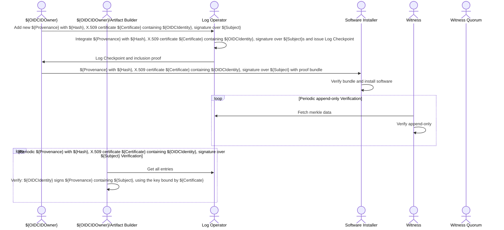

<!--- This content generated with:
go run github.com/google/trillian/docs/claimantmodel/experimental/cmd/render@master --full_model_file ./docs/claimantmodel/rekor/provenance/full.yaml 
-->

```mermaid
sequenceDiagram
    actor ${OIDCIDOwner}
    actor ${OIDCIDOwner}/Artifact Builder
    actor Log Operator
    actor Software Installer
    actor Witness
    actor Witness Quorum
    ${OIDCIDOwner}->>Log Operator: Add new ${Provenance} with ${Hash}, X.509 certificate ${Certificate} containing ${OIDCIdentity}, signature over ${Subject}
    Log Operator->>Log Operator: Integrate ${Provenance} with ${Hash}, X.509 certificate ${Certificate} containing ${OIDCIdentity}, signature over ${Subject}s and issue Log Checkpoint
    Log Operator->>${OIDCIDOwner}: Log Checkpoint and inclusion proof
    ${OIDCIDOwner}->>Software Installer: ${Provenance} with ${Hash}, X.509 certificate ${Certificate} containing ${OIDCIdentity}, signature over ${Subject} with proof bundle
    Software Installer->>Software Installer: Verify bundle and install software
    loop Periodic append-only Verification
        Witness->>Log Operator: Fetch merkle data
        Witness->>Witness: Verify append-only
    end
    loop Periodic ${Provenance} with ${Hash}, X.509 certificate ${Certificate} containing ${OIDCIdentity}, signature over ${Subject} Verification
        ${OIDCIDOwner}/Artifact Builder->>Log Operator: Get all entries
        ${OIDCIDOwner}/Artifact Builder->>${OIDCIDOwner}/Artifact Builder: Verify: ${OIDCIdentity} signs ${Provenance} containing ${Subject}, using the key bound by ${Certificate}
    end
```