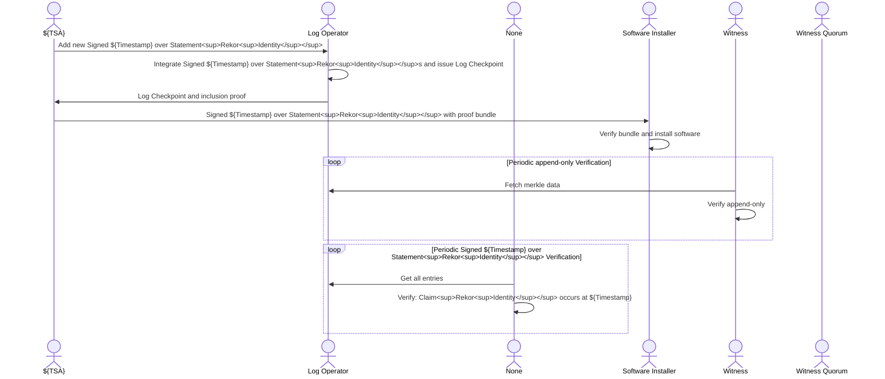

```mermaid
sequenceDiagram
    actor ${TSA}
    actor Log Operator
    actor None
    actor Software Installer
    actor Witness
    actor Witness Quorum
    ${TSA}->>Log Operator: Add new Signed ${Timestamp} over Statement<sup>Rekor<sup>Identity</sup></sup>
    Log Operator->>Log Operator: Integrate Signed ${Timestamp} over Statement<sup>Rekor<sup>Identity</sup></sup>s and issue Log Checkpoint
    Log Operator->>${TSA}: Log Checkpoint and inclusion proof
    ${TSA}->>Software Installer: Signed ${Timestamp} over Statement<sup>Rekor<sup>Identity</sup></sup> with proof bundle
    Software Installer->>Software Installer: Verify bundle and install software
    loop Periodic append-only Verification
        Witness->>Log Operator: Fetch merkle data
        Witness->>Witness: Verify append-only
    end
    loop Periodic Signed ${Timestamp} over Statement<sup>Rekor<sup>Identity</sup></sup> Verification
        None->>Log Operator: Get all entries
        None->>None: Verify: Claim<sup>Rekor<sup>Identity</sup></sup> occurs at ${Timestamp}
    end
```